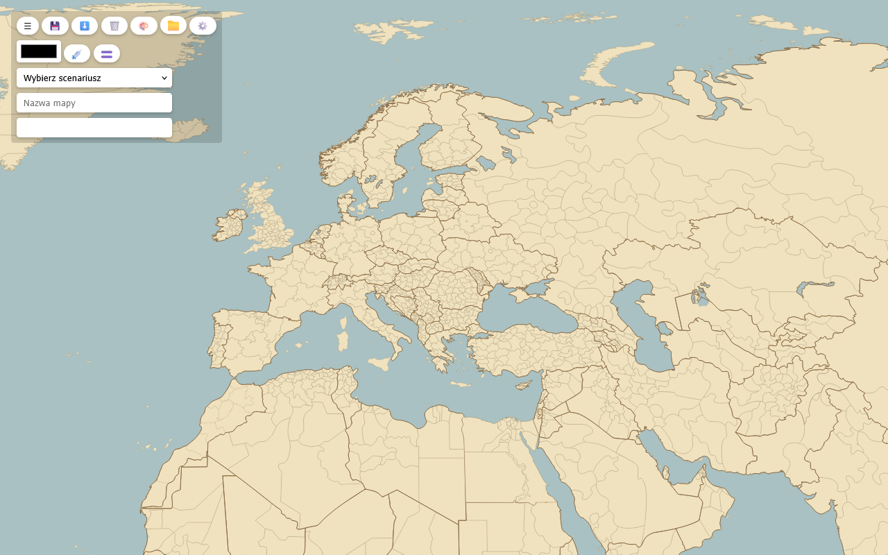

# Mapa Świata

Edytor map. Obejmuje państwa oraz jednostki administracyjne najwyższego poziomu.

[skotniczny.github.io/mapa](https://skotniczny.github.io/mapa/)



## Malowanie

Klik zamalowuje region wybranym kolorem, ponowne kliknięcie tym samym kolorem go
czyści. Prawy przycisk zazwyczaj obejmuje od razu wszystkie regiony jednego
państwa. Tryb kreskowania (`🟰`) nakłada ukośne paski w drugim kolorze, pipeta
(`💉`) pobiera kolor z regionu.

## Pasek narzędzi

- `💾` zapis do JSON-a
- `⬇️` pobranie mapy jako SVG
- `🗑️` czyszczenie mapy
- `🎨` pokrycie mapy losowymi kolorami
- `⚙️` konfiguracja
- `💉` pobranie koloru z regionu
- `🟰` tryb kreskowania

## Uruchomienie

```sh
npm install
npm start       # tryb dev
npm run build   # buduje aplikację do dist/
npm run deploy  # build i publikacja na GitHub Pages (branch gh-pages)
npm test        # sprawdzenie stylu kodu linterem standard
```

## Mapa

[Blank_Map_World_Secondary_Political_Divisions.svg](https://commons.wikimedia.org/wiki/File:Blank_Map_World_Secondary_Political_Divisions.svg) z Wikimedia Commons, licencja CC0
